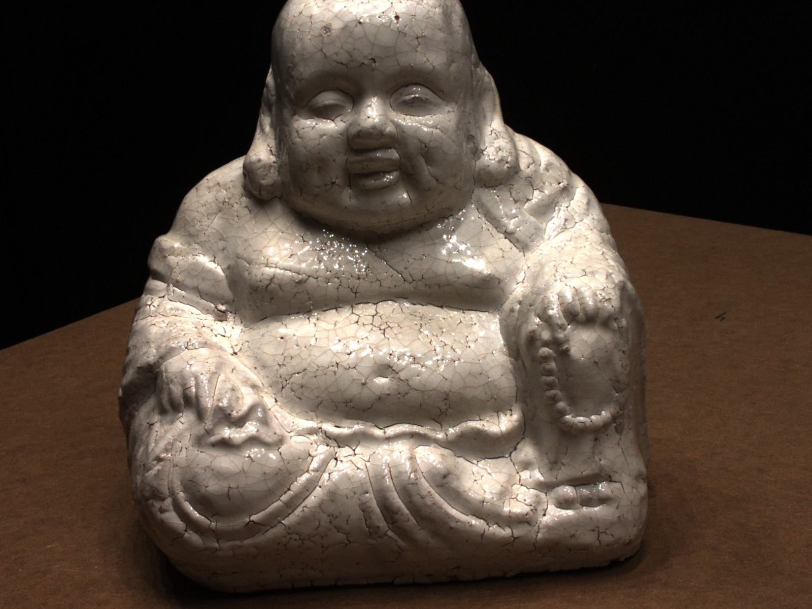
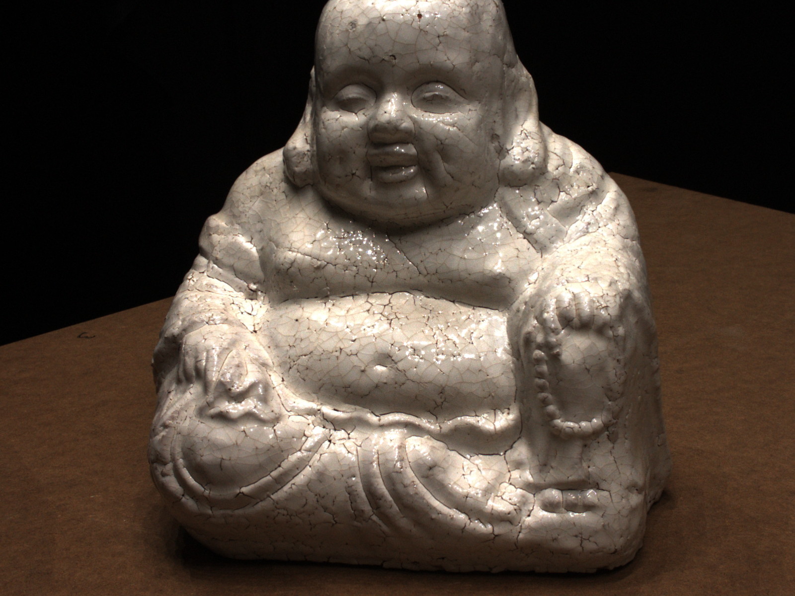
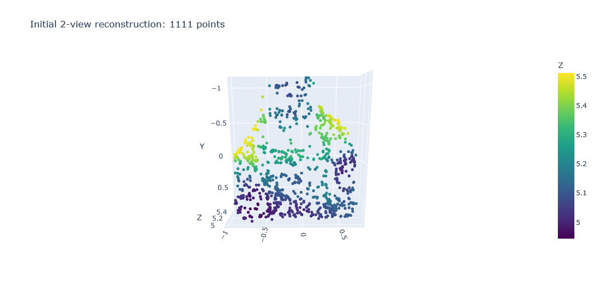

<div id="top"></div>

<br />
<div align="center">
  <h1 align="center">Structure from Motion From Scratch</h1>

  <p align="center">
    A NumPy-first sparse Structure-from-Motion pipeline for incremental 3D reconstruction from multiple images.
    <br />
    Built mostly from scratch using SIFT matching, Fundamental/Essential matrix estimation, triangulation, PnP-based pose estimation, and 3D point cloud visualization.
  </p>
</div>

---

## About The Project

This project implements a sparse Structure-from-Motion pipeline from scratch using images from the **DTU dataset**.

Given a sequence of images from the DTU dataset, the pipeline reconstructs a sparse 3D point cloud by estimating camera motion and triangulating matched image features across frames.


The reconstruction pipeline includes:

* SIFT feature detection and descriptor matching
* mutual feature matching
* normalized 8-point Fundamental matrix estimation
* RANSAC-based inlier filtering
* Essential matrix computation
* relative camera pose estimation
* custom triangulation using projection equations
* incremental PnP-based camera pose estimation
* track-based point updates across frames
* sparse 3D point cloud reconstruction
* interactive 3D visualization using Plotly

This implementation is designed as a learning-focused SfM baseline rather than a production-level reconstruction system.

---

## Dataset

This project uses images from the [**DTU dataset**](https://roboimagedata.compute.dtu.dk/) for sparse 3D reconstruction experiments.

The DTU dataset provides multi-view image sequences with camera information, making it suitable for learning and experimenting with Structure-from-Motion pipelines.

---

## Input Preview

Original input images used for reconstruction:

<p align="center">
  
  
</p>

---

## 3D Reconstruction Preview

Sparse 3D point cloud generated by the SfM pipeline:

<p align="center">
  
</p>

---

## 3D Plot Video

Recorded video of the interactive 3D reconstruction plot:

<p align="center">
  
</p>

<!-- 
If GitHub renders your video directly, you can also try:

<p align="center">
  <video src="videos/3d_reconstruction.mp4" controls width="800"></video>
</p>
-->

---

## Built With

* Python
* NumPy
* OpenCV
* SciPy
* Matplotlib
* Plotly

---

## Project Structure

```bash
.
├── DTU/
│   └── scan114/
│       ├── image/
│       │   ├── 000033.png
│       │   ├── 000034.png
│       │   └── ...
│       └── cameras.npz
├── images/
│   ├── original_1.png
│   ├── original_2.png
│   └── point_cloud.png
├── videos/
│   └── 3d_reconstruction.mp4
├── structure-from-motion.ipynb
└── README.md
```

---

## Method Overview

The pipeline starts with a seed image pair and estimates the initial camera relationship using the Fundamental and Essential matrices. After recovering the initial relative pose, matched feature points are triangulated to create the first sparse 3D reconstruction.

For subsequent images, the pipeline uses existing 3D points and their matched 2D observations to estimate the new camera pose using PnP. Once the new pose is estimated, feature tracks are updated and additional points can be triangulated into the global reconstruction frame.

---

## Key Learning Goals

This project was built to understand the core geometry behind Structure from Motion, especially:

* how 2D image correspondences become 3D points
* how camera pose is recovered from matched features
* why feature tracks matter across frames
* how PnP depends on correct 3D-2D correspondences
* why noisy matches can break incremental reconstruction
* how triangulation behaves when pose or matches are inaccurate

---

## Notes

This is a from-scratch educational implementation. Most of the geometry and matrix operations are implemented manually using NumPy, while OpenCV is mainly used for SIFT feature extraction and image loading.

The reconstruction quality depends heavily on feature matching, camera baseline, PnP stability, and filtering of noisy triangulated points.
